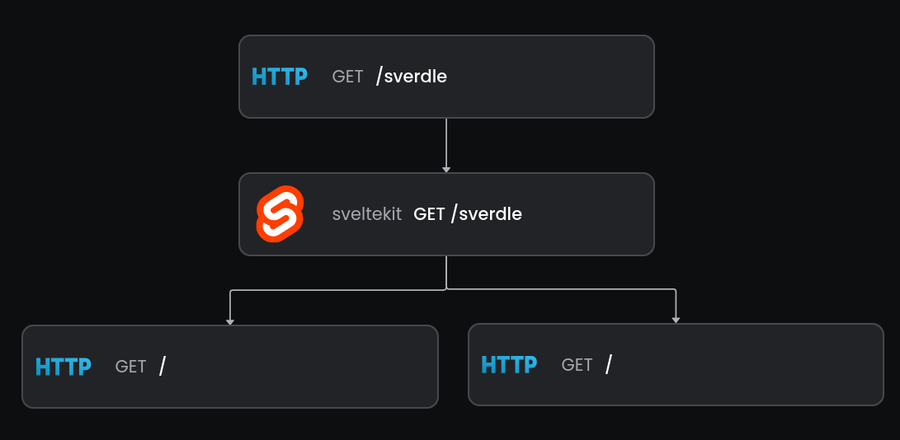

# Svelte Kit OpenTelemetry Middleware
[![Documentation][docs_badge]][docs]
[![Latest Release][release_badge]][release]
[![License][license_badge]][license]

A streamlined OpenTelemetry Middleware for SvelteKit




## Getting Started

Install the packages

```bash
npm i @baselime/node-opentelemetry @baselime/sveltekit-opentelemetry-middleware
```

Add the following code to your `root.server.{ts|js}`

```javascript
import { withOpenTelemetry } from '@baselime/sveltekit-opentelemetry-middleware'
import { BaselimeSDK } from '@baselime/node-opentelemetry';

new BaselimeSDK({}).start();

export const handle = withOpenTelemetry(async ({ event, resolve }) => {
    return resolve(event);
});
```

To configure the BaselimeSDK visit the [documentation](https://baselime.io/docs/sending-data/languages/node.js/)

## Options

The withOpenTelemetry function takes the following options

| Parameter             | Type      | Description                                              |
|-----------------------|-----------|----------------------------------------------------------|
| captureRequestBody    | boolean   | Capture the request body in the span. (Optional)         |
| captureResponseBody   | boolean   | Capture the response body in the span. (Optional)        |
| requestIdHeader       | string    | The header to look for the request id in. By default it will check x-request-id and x-vercel

## License

&copy; Baselime Limited, 2023

Distributed under MIT License (`The MIT License`).

See [LICENSE](LICENSE) for more information.


[docs]: https://baselime.io/docs/
[docs_badge]: https://img.shields.io/badge/docs-reference-blue.svg?style=flat-square
[release]: https://github.com/baselime/sveltekit-opentelemetry-middleware/releases/latest
[release_badge]: https://img.shields.io/github/release/baselime/sveltekit-opentelemetry-middleware.svg?style=flat-square&ghcache=unused
[license]: https://opensource.org/licenses/MIT
[license_badge]: https://img.shields.io/github/license/baselime/sveltekit-opentelemetry-middleware.svg?color=blue&style=flat-square&ghcache=unused
